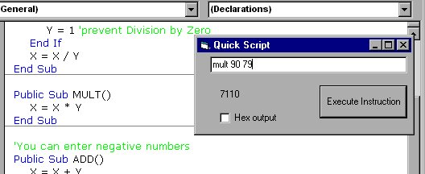



## An Easy OOP Script engine

### Description

Simple scripting language using classes. Uses callbyname function to run a classes methods. This allows for very fast parsing, because there is no IF Then or Case statements. Create a class module with the functions that you want in your scripting 'language'. Then you can simply send a string of text into the class' parse function to get the name of the function and the values to be operated on. After you have gotten the name, use CallByName with the vbMethod operator. This is a quick class (OOP) example. To keep it simple, I didn't include properties, only public and private variables.
 
### More Info
 
The result of an operation

             |
---                |---
**Submitted On**   |2002-05-28 11:38:28
**By**             |[Erik Stites](https://github.com/Planet-Source-Code/PSCIndex/blob/master/ByAuthor/erik-stites.md)
**Level**          |Beginner
**User Rating**    |5.0 (40 globes from 8 users)
**Compatibility**  |VB 5\.0, VB 6\.0
**Category**       |[Object Oriented Programming \(OOP\)](https://github.com/Planet-Source-Code/PSCIndex/blob/master/ByCategory/object-oriented-programming-oop__1-47.md)
**World**          |[Visual Basic](https://github.com/Planet-Source-Code/PSCIndex/blob/master/ByWorld/visual-basic.md)
**Archive File**   |[An\_Easy\_OO878655282002\.zip](https://github.com/Planet-Source-Code/erik-stites-an-easy-oop-script-engine__1-35210/archive/master.zip)

